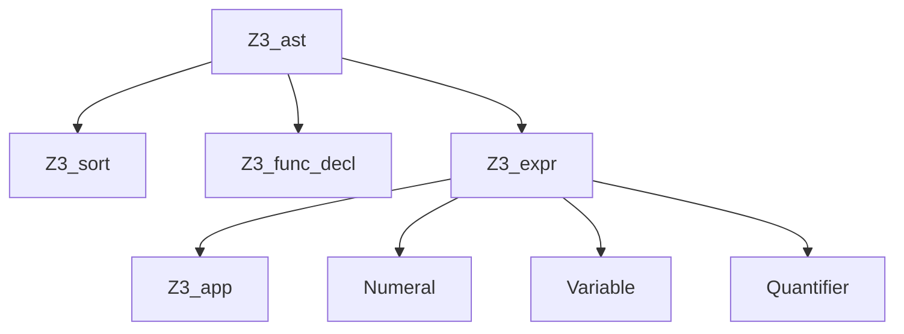

## Overview

In Z3, all terms, formulas, and types are represented as **Abstract Syntax Trees (ASTs)**. The expression system is the foundation for building and manipulating logical formulas.

## AST Hierarchy

Z3's AST nodes form a hierarchy:



### Core AST Types

<Accordion title="Z3_sort - Type/Sort">
  Represents types in Z3's type system:
  - Basic sorts: `Bool`, `Int`, `Real`
  - Bit-vector sorts: `(_ BitVec n)`
  - Array sorts: `(Array Domain Range)`
  - Datatypes: user-defined algebraic types
  - Uninterpreted sorts: abstract types
</Accordion>

<Accordion title="Z3_func_decl - Function Declaration">
  Declares functions and constants:
  - Constants: 0-arity functions
  - Uninterpreted functions: no specified meaning
  - Interpreted functions: built-in operations (+, *, etc.)
</Accordion>

<Accordion title="Z3_app - Function Application">
  Applications of functions to arguments:
  - Constants are 0-arity applications
  - Operations like `x + y` are applications of `+` to `[x, y]`
</Accordion>

## Creating Sorts

<CodeGroup>
```python Python
from z3 import *

# Built-in sorts
bool_sort = BoolSort()
int_sort = IntSort()
real_sort = RealSort()

# Bit-vector sort (32 bits)
bv_sort = BitVecSort(32)

# Array sort (Int -> Int)
array_sort = ArraySort(IntSort(), IntSort())

# Uninterpreted sort
U = DeclareSort('U')

# Datatype (recursive list)
List = Datatype('List')
List.declare('nil')
List.declare('cons', ('head', IntSort()), ('tail', List))
ListSort = List.create()
```

```cpp C++
#include <z3++.h>
using namespace z3;

context c;

// Built-in sorts
sort bool_sort = c.bool_sort();
sort int_sort = c.int_sort();
sort real_sort = c.real_sort();

// Bit-vector sort
sort bv_sort = c.bv_sort(32);

// Array sort
sort array_sort = c.array_sort(int_sort, int_sort);

// Uninterpreted sort
sort U = c.uninterpreted_sort("U");
```
</CodeGroup>

## Creating Expressions

### Constants and Variables

```python
from z3 import *

# Boolean constant
p = Bool('p')

# Integer constants
x = Int('x')
y = Int('y')

# Real constant
z = Real('z')

# Bit-vector constant (32-bit)
a = BitVec('a', 32)

# Array constant
A = Array('A', IntSort(), IntSort())
```

### Numerals

```python
# Integer literals
zero = IntVal(0)
ten = IntVal(10)

# Real literals (exact rational)
half = RealVal("1/2")  # Exact: 1/2
approx = RealVal(0.5)   # May lose precision
frac = RealVal(1, 2)    # Exact: 1/2

# Bit-vector literals
bv_val = BitVecVal(42, 32)  # 32-bit value 42
```

### Function Applications

```python
from z3 import *

x, y = Ints('x y')

# Arithmetic operations are function applications
expr1 = x + y       # Application of '+'
expr2 = x * 2       # Application of '*'
expr3 = x > y       # Application of '>'

# Uninterpreted function
f = Function('f', IntSort(), IntSort(), IntSort())
expr4 = f(x, y)     # Application of 'f'

# Check structure
print(expr1.decl())          # +
print(expr1.num_args())      # 2
print(expr1.arg(0))          # x
print(expr1.arg(1))          # y
```

## Expression Kinds

From `z3_api.h:170`, Z3 defines these AST kinds:

```cpp
typedef enum {
    Z3_NUMERAL_AST,      // Numeric constants
    Z3_APP_AST,          // Function applications
    Z3_VAR_AST,          // Bound variables (in quantifiers)
    Z3_QUANTIFIER_AST,   // Quantified formulas
    Z3_SORT_AST,         // Sorts/types
    Z3_FUNC_DECL_AST,    // Function declarations
    Z3_UNKNOWN_AST       // Internal
} Z3_ast_kind;
```

<CodeGroup>
```python Python
from z3 import *

x = Int('x')
expr = x + 10

# Query expression kind
print(expr.decl().kind())  # Z3_OP_ADD
print(is_app(expr))        # True
print(is_const(x))         # True
```

```cpp C++
#include <z3++.h>
using namespace z3;

context c;
expr x = c.int_const("x");
expr e = x + 10;

// Query AST kind
Z3_ast_kind kind = Z3_get_ast_kind(c, e);
std::cout << (kind == Z3_APP_AST) << std::endl;  // true
```
</CodeGroup>

## Boolean Formulas

```python
from z3 import *

p, q, r = Bools('p q r')

# Logical connectives
formula1 = And(p, q)
formula2 = Or(p, q, r)
formula3 = Not(p)
formula4 = Implies(p, q)
formula5 = p == q  # Equivalence (iff)

# De Morgan's laws
conjecture = (Not(And(p, q)) == Or(Not(p), Not(q)))

# Verify it's a tautology
prove(conjecture)
```

## Arithmetic Expressions

```python
from z3 import *

x, y, z = Ints('x y z')

# Linear arithmetic
linear = 2*x + 3*y - z

# Nonlinear arithmetic
nonlinear = x * y + z * z

# Comparisons
constraint = And(x >= 0, x + y <= 10, z > x)

# Division (integer)
quot = x / y   # Integer division
rem = x % y    # Remainder
```

## Bit-Vector Operations

```python
from z3 import *

x = BitVec('x', 32)
y = BitVec('y', 32)

# Arithmetic
expr1 = x + y
expr2 = x * y
expr3 = -x

# Bitwise operations
expr4 = x & y      # AND
expr5 = x | y      # OR
expr6 = x ^ y      # XOR
expr7 = ~x         # NOT

# Shifts
expr8 = x << 2     # Left shift
expr9 = x >> 3     # Logical right shift

# Comparison (signed vs unsigned)
expr10 = x < y      # Signed comparison
expr11 = ULT(x, y)  # Unsigned comparison

# Extract and concatenate
low_bits = Extract(15, 0, x)   # Extract bits 15-0
high_bits = Extract(31, 16, x) # Extract bits 31-16
combined = Concat(x, y)         # 64-bit concatenation
```

## Array Expressions

```python
from z3 import *

A = Array('A', IntSort(), IntSort())
i, j, v = Ints('i j v')

# Array operations
read = A[i]                    # Select: read at index i  
write = Store(A, i, v)         # Store: update at index i
read_after = write[j]          # Read from updated array

# Array axioms are built-in
s = Solver()
s.add(i == j)
s.add(Store(A, i, v)[j] != v)
print(s.check())  # unsat - array axiom contradiction
```

## Expression Traversal

From `examples/c++/example.cpp:807`:

```python
from z3 import *

def visit(e, seen=None):
    """Recursively visit all subexpressions"""
    if seen is None:
        seen = set()
    
    if e.get_id() in seen:
        return
    seen.add(e.get_id())
    
    if is_app(e):
        print(f"Application of {e.decl().name()}: {e}")
        for child in e.children():
            visit(child, seen)
    elif is_quantifier(e):
        print(f"Quantifier: {e}")
        visit(e.body(), seen)
    else:
        print(f"Leaf: {e}")

# Example usage
x, y = Ints('x y')
f = x*x + x*x - y*y >= 0
visit(f)
```

## Expression Simplification

```python
from z3 import *

x, y = Ints('x y')

# Create complex expression
expr = And(x > 0, x > 0, Or(y < 0, False))

# Simplify
simplified = simplify(expr)
print(simplified)  # And(x > 0, y < 0)

# Algebraic simplification
algebraic = simplify(x + x + x)
print(algebraic)  # 3*x
```

## If-Then-Else Terms

```python
from z3 import *

x, y = Ints('x y')
b = Bool('b')

# Conditional expression
result = If(b, x, y)

# Type must match both branches
result2 = If(x > 0, x + 1, x - 1)  # Both branches are Int
```

## Substitution

From `examples/c++/example.cpp:1147`:

```python
from z3 import *

x = Int('x')
f = Or(x == 2, x == 1)

print(f)  # Or(x == 2, x == 1)

# Substitute 2 with 3
f_subst = substitute(f, (IntVal(2), IntVal(3)))
print(f_subst)  # Or(x == 3, x == 1)
```

## Memory Management

<Warning>
Z3 uses reference counting for memory management. In C/C++:

- Always increment refs with `Z3_inc_ref`
- Decrement with `Z3_dec_ref` when done
- The C++ API handles this automatically
- Python API is fully garbage-collected
</Warning>

```cpp
// C API - manual reference counting
Z3_context ctx = Z3_mk_context(cfg);
Z3_ast x = Z3_mk_int_const(ctx, Z3_mk_string_symbol(ctx, "x"));
Z3_inc_ref(ctx, x);  // Increment ref
// ... use x ...
Z3_dec_ref(ctx, x);  // Decrement when done
```

## Related Topics

<CardGroup cols={3}>
  <Card title="SMT Solving" href="/concepts/smt-solving">
    Learn about satisfiability checking
  </Card>
  <Card title="Solvers" href="/concepts/solvers">
    Using expressions with solvers
  </Card>
  <Card title="Quantifiers" href="/concepts/quantifiers">
    Quantified expressions
  </Card>
</CardGroup>

## References

- Z3 API: `src/api/z3_api.h:7-179`
- AST implementation: `src/api/api_ast.cpp`
- Examples: `examples/c++/example.cpp`